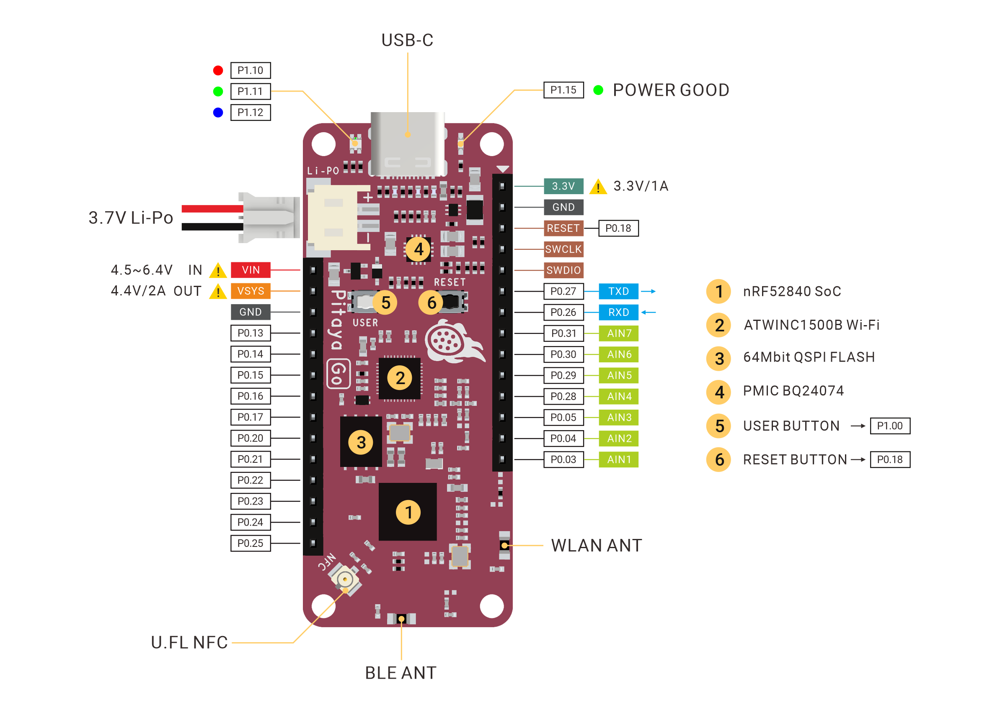

# Pitaya Go 

> An Open-Source IoT Development Platform with Multiprotocol Wireless Connectivity

## Description

Pitaya Go is a compact and versatile development platform for IoT solutions, combining the Nordic's high-end multiprotocol SoC [nRF52840](https://www.nordicsemi.com/Products/Low-power-short-range-wireless/nRF52840) and the Microchip's extreme low power Wi-Fi® network controller [ATWINC1500B](https://www.microchip.com/wwwproducts/en/ATWINC1500-IC). It offers a complete solution for wireless connectivity with IEEE 802.11 b/g/n, Bluetooth 5, Thread and Zigbee, that is specifically designed for the IoT.

Pitaya Go features a Battery Charger with power path management, 64Mbit ultra low power QSPI Flash memory, additional NFC-A Tag PCB Antenna, user programmable RGB LED and Buttons, reversible USB-C Connector and easily expandable Header Sockets. All these features above make this board an ideal choice for the next IoT project.

## Features

* Nordic Semiconductor nRF52840 SoC
	- 64 MHz Arm® Cortex-M4 with FPU
	- 1 MB Flash + 256 KB RAM
	- Bluetooth 5, Bluetooth mesh, Thread, Zigbee, 802.15.4, ANT and 2.4 GHz proprietary
	- Arm TrustZone® Cryptocell 310 Security Subsystem
	- Integrated USB 2.0 Full-speed Controller
	- QSPI/SPI/TWI/I²S/PDM/QDEC/ADC support
	- Integrated NFC-A Tag
* Microchip ATWINC1500B Wi-Fi Network Controller
	- Shipped with the latest firmware 19.6.1
	- IEEE 802.11 b/g/n 20 MHz (1x1) Solution
	- Extreme low power
	- On-Chip Network Stack to Offload MCU
	- Supports Soft-AP
	- Security protocols supported: WPA/WPA2 Personal, TLS/SSL
	- Enterprise Security with WPA/WPA2 (802.11x) 
	- Network services: DHCP, DNS, TCP/IP (IPv4), UDP, HTTP, HTTPS, MQTT
* 64Mbit ultra-low power QSPI Flash Memory
* Integrated Li-Po Battery Charger with Power Path Management
* Additional NFC-A Tag PCB Antenna
* User programmable RGB LED and Buttons
* Dual Wi-Fi/Bluetooth 2.4G Chip Antennas
* Reversible USB-C Connector
* Li-Po Battery Connector
* Easily expandable dual 14-Pin Header Sockets
* Measures 2.4" x 1.0" x 0.3" (60.96mm x 25.4mm x 7.6mm)

## Hardware Diagram

## Included in the Box

|    **Part**     | **Qty** |
| --------------- | ------- |
| Pitaya Go Board | 1       |
| NFC PCB Antenna | 1       |
| USB-C Cable     | 1       |

## Tutorials

We think the best way to learn is by doing. And to help you get started, we have provided a series of tutorials. Find the details below:

* [Pitaya Go Developer Docs](https://wiki.makerdiary.com/pitaya-go/)
* [Getting Started with Pitaya Go](https://wiki.makerdiary.com/pitaya-go/getting-started)
* [How to Program Pitaya Go](https://wiki.makerdiary.com/pitaya-go/programming)
* [nRF5 SDK Tutorials](https://wiki.makerdiary.com/pitaya-go/nrf5-sdk)
* [Wi-Fi Tutorials](https://wiki.makerdiary.com/pitaya-go/wifi)
* [OpenThread Tutorials](https://wiki.makerdiary.com/pitaya-go/openthread)

## Design Files

* [Pitaya Go Pinout Diagram V1.0](docs/hw/pitaya-go_pinout_v1_0.pdf)
* [Pitaya Go Schematic V1.0](docs/hw/pitaya-go_schematic_v1_0.pdf)
* [Pitaya Go Board File V1.0](docs/hw/pitaya-go_board_file_v1_0.pdf)
* [Pitaya Go 3D STEP V1.0](docs/hw/pitaya-go_3d_v1_0.step)

## Where to Buy

Pitaya Go is available on the following channels (click to go directly to the product):

## Contributing

We would love for you to contribute to this project and help make it even better than it is today! See our [Contributing Guidelines](https://wiki.makerdiary.com/pitaya-go/CONTRIBUTING) for more information.

## License

**MIT License**

Copyright (c) 2019 [makerdiary](https://makerdiary.com)

Permission is hereby granted, free of charge, to any person obtaining a copy
of this software and associated documentation files (the "Software"), to deal
in the Software without restriction, including without limitation the rights
to use, copy, modify, merge, publish, distribute, sublicense, and/or sell
copies of the Software, and to permit persons to whom the Software is
furnished to do so, subject to the following conditions:

The above copyright notice and this permission notice shall be included in all
copies or substantial portions of the Software.

THE SOFTWARE IS PROVIDED "AS IS", WITHOUT WARRANTY OF ANY KIND, EXPRESS OR
IMPLIED, INCLUDING BUT NOT LIMITED TO THE WARRANTIES OF MERCHANTABILITY,
FITNESS FOR A PARTICULAR PURPOSE AND NONINFRINGEMENT. IN NO EVENT SHALL THE
AUTHORS OR COPYRIGHT HOLDERS BE LIABLE FOR ANY CLAIM, DAMAGES OR OTHER
LIABILITY, WHETHER IN AN ACTION OF CONTRACT, TORT OR OTHERWISE, ARISING FROM,
OUT OF OR IN CONNECTION WITH THE SOFTWARE OR THE USE OR OTHER DEALINGS IN THE
SOFTWARE.
