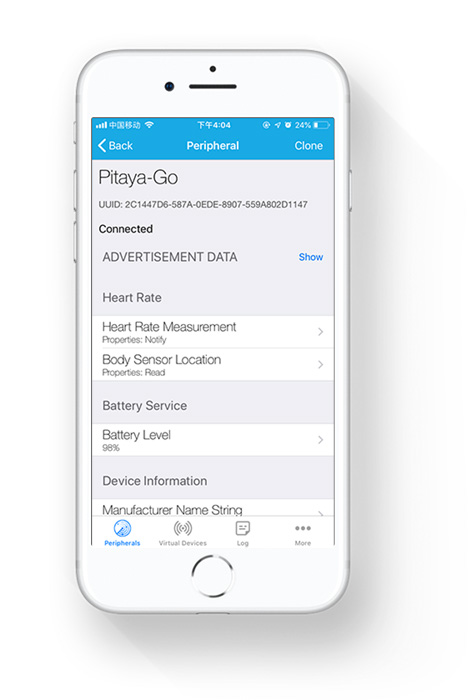
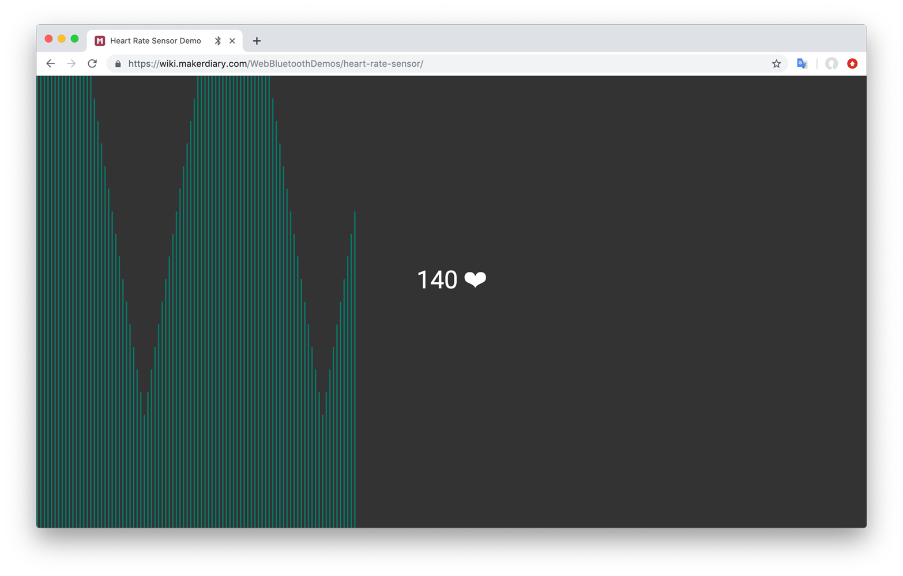

# BLE Heart Rate Sensor Example

## Description

The BLE Heart Rate Sensor Example is an example that implements the Heart Rate profile running on Pitaya Go.

The application includes the three services in the Heart Rate profile:

* Heart Rate Service
* Battery Service
* Device Information Service

When the application starts, the BSP is initialized. Next, three timers are started. These timers control the generation of various parts of the Heart Rate Measurement characteristic value:

* Heart Rate
* RR Interval
* Sensor Contact Detected

Also, a timer for generating battery measurements is started.

When notification of Heart Rate Measurement characteristic is enabled, the Heart Rate Measurement, containing the current value for all the components of the Heart Rate Measurement characteristic, is notified each time the Heart Rate measurement timer expires. When notification of Battery Level characteristic is enabled, the Battery Level is notified each time the Battery Level measurement timer expires.

!!! Tip
	Before you start building, remember to set up the nRF5 SDK development environment first. See [Setup the nRF5 SDK](../setup-the-nrf5-sdk.md) for details.

## Building the example

You can find the source code and the project file of the example in the following folder: [pitaya-go/examples/ble/ble_app_hrs](https://github.com/makerdiary/pitaya-go/tree/master/examples/ble/ble_app_hrs).

Open terminal and navigate to the directory with the example Makefile:

``` sh
cd ./pitaya-go/examples/ble/ble_app_hrs/armgcc
```

Run `make` to build the example:

``` sh
make
```

## Programming the firmware

If compiled successfully, the firmware is located in `ble_app_hrs/armgcc/_build` with the name `nrf52840_xxaa.hex`.

While pushing the **USER** button, press the **RESET** button to enter the DFU mode. Then program the firmware using the [nRF Connect for Desktop](https://www.nordicsemi.com/Software-and-Tools/Development-Tools/nRF-Connect-for-desktop) tool.

If the SoftDevice is not programmed before, remember to add the SoftDevice. The SoftDevice is located in `<nRF5 SDK>/components/softdevice/s140/hex/s140_nrf52_6.1.0_softdevice.hex`.

!!! Tip
	See **[Programming](../../programming.md)** section for details about how to program your Pitaya Go.

## Testing

You can test the application with the **LightBlue** app by performing the following steps:

1. Download the **LightBlue** app from App Store or Google Play.

2. Connect to the device from LightBlue (the device is advertising as **Pitaya-Go**).

3. Observe that the services are shown in the connected device and that you can start receiving values for the Heart Rate and the Battery Service by clicking the 'Listen for notifications'. Heart Rate notifications are received every second, and Battery Level notifications are received every two seconds.



You can also use the Web Bluetooth API to test the example:

<a href="https://wiki.makerdiary.com/WebBluetoothDemos/heart-rate-sensor/" target="_blank"><button data-md-color-primary="marsala">Web Bluetooth API</button></a>



## Create an Issue

Interested in contributing to this project? Want to report a bug? Feel free to click here:

<a href="https://github.com/makerdiary/pitaya-go/issues/new"><button data-md-color-primary="marsala"><i class="fa fa-github"></i> Create an Issue</button></a>


