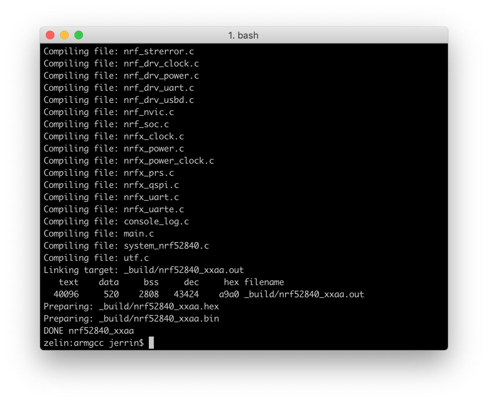
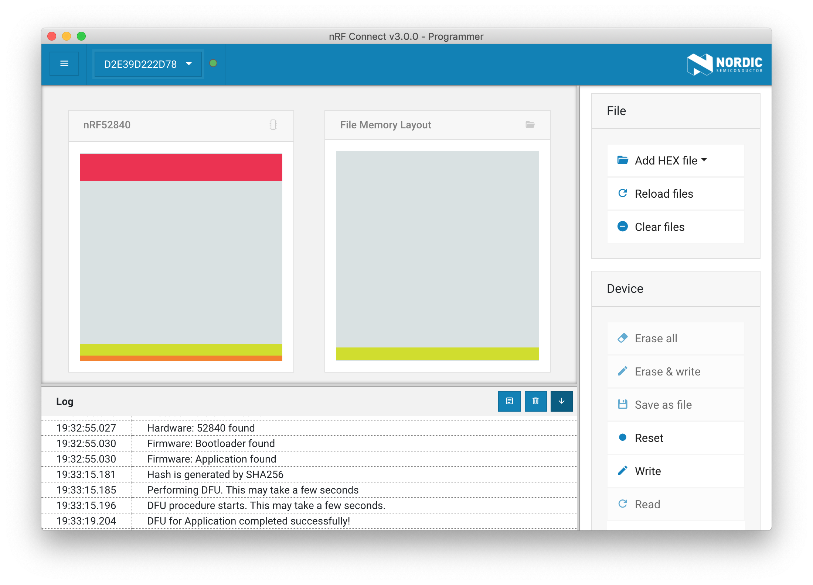

# Building and Running a first example

This section details how to build and run the Hello World example.

Before you start building, remember to set up the nRF5 SDK development environment first. See [Setup the nRF5 SDK](setup-the-nrf5-sdk.md) for details.

## Building the example

Now it's ready to build the first example. Will use the Hello World example here to keep it simple. 

The Hello World example shows how to blink the RGB LED and print `Hello World!` to the console. It is located in [pitaya-go/examples/peripheral/hello_world](https://github.com/makerdiary/pitaya-go/tree/master/examples/peripheral/hello_world).

Open terminal and navigate to the directory with the example Makefile:

``` sh
cd ./pitaya-go/examples/peripheral/hello_world/armgcc
```

Run `make` to build the example:

``` sh
make
```



## Programming the firmware

After compiled, the firmware is located in `hello_world/armgcc/_build` with the name `nrf52840_xxaa.hex`.

Now let Pitaya Go enter the DFU (Device Firmware Update) mode, and program the firmware using the [nRF Connect for Desktop](https://www.nordicsemi.com/Software-and-Tools/Development-Tools/nRF-Connect-for-desktop) tool.



!!! Tip
	See **[Programming](../programming.md)** section for details about how to program your Pitaya Go.

## Testing

Once the firmware is programmed successfully, observe that the LEDs are blinking:


Run a terminal application like [PuTTY](https://www.chiark.greenend.org.uk/~sgtatham/putty/) or [screen](https://www.gnu.org/software/screen/manual/screen.html) to print `Hello World!`:

``` sh
screen /dev/cu.usbmodemD2E39D222D781 115200
```
where `/dev/cu.usbmodemD2E39D222D781` is the port name of the board. Replace it with your owns.


## Next Steps

Check out more nRF5 SDK examples for Pitaya Go:

* **Hardware Peripheral Examples**

	- [Blinky Example](peripheral/blinky-example.md)
	- [Button Example](peripheral/button-example.md)
	- [Battery Status Example](peripheral/battery-example.md)
	- [NFC Tag Example](peripheral/nfc-example.md)
	- [Power Profiler Example](peripheral/power-profiler-example.md)
	- [QSPI Flash Example](peripheral/qspi-example.md)
	- [RSSI Viewer Example](peripheral/rssi-viewer-example.md)
	- [Temperature Example](peripheral/temperature-example.md)

* **Bluetooth Low Energy Examples**

	- [BLE Blinky Example](ble/ble-blinky-example.md)
	- [BLE Beacon Example](ble/ble-beacon-example.md)
	- [BLE Battery Service Example](ble/ble-bas-example.md)
	- [BLE Heart Rate Service](ble/ble-hrs-example.md)
	- [BLE HID Keyboard Example](ble/ble-hids-keyboard-example.md)
	- [BLE HID Mouse Example](ble/ble-hids-mouse-example.md)


## Create an Issue

Interested in contributing to this project? Want to report a bug? Feel free to click here:

<a href="https://github.com/makerdiary/pitaya-go/issues/new"><button data-md-color-primary="marsala"><i class="fa fa-github"></i> Create an Issue</button></a>
