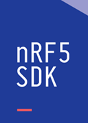

# nRF5 SDK  <small>Essential Software Development Kit for the nRF5x Series SoC</small>

## Introduction

The nRF5 SDK is your first stop for building fully featured, reliable and secure applications with the nRF52 and nRF51 Series. It offers developers a wealth of varied modules and examples right across the spectrum including numerous Bluetooth Low Energy profiles, Device Firmware Upgrade (DFU), GATT serializer and driver support for all peripherals on all nRF5 Series devices. The nRF5 SDK will almost certainly have something for your needs in developing exciting yet robust wireless products.

The SDK is delivered as a plain .zip-archive, which makes it easy to install as well as giving you the freedom to choose the IDE and compiler of your choice.

For more details, please visit the [Nordic Semiconductor](https://www.nordicsemi.com/Software-and-Tools/Software/nRF5-SDK/) site.

Our nRF5 SDK tutorials include descriptions and other reference material to ensure that everything is set up correctly. Examples are provided to help you to build state-of-the-art IoT applications in a very short time.

See [Setup the nRF5 SDK](setup-the-nrf5-sdk.md) for instructions on how to set up your development environment.

## Reference

* [nRF5 SDK Offical Site](https://www.nordicsemi.com/Software-and-Tools/Software/nRF5-SDK/)
* [nRF5 SDK Online Documentation](https://infocenter.nordicsemi.com/topic/com.nordic.infocenter.sdk5.v15.2.0/index.html)

## Create an Issue

Interested in contributing to this project? Want to report a bug? Feel free to click here:

<a href="https://github.com/makerdiary/pitaya-go/issues/new"><button data-md-color-primary="marsala"><i class="fa fa-github"></i> Create an Issue</button></a>