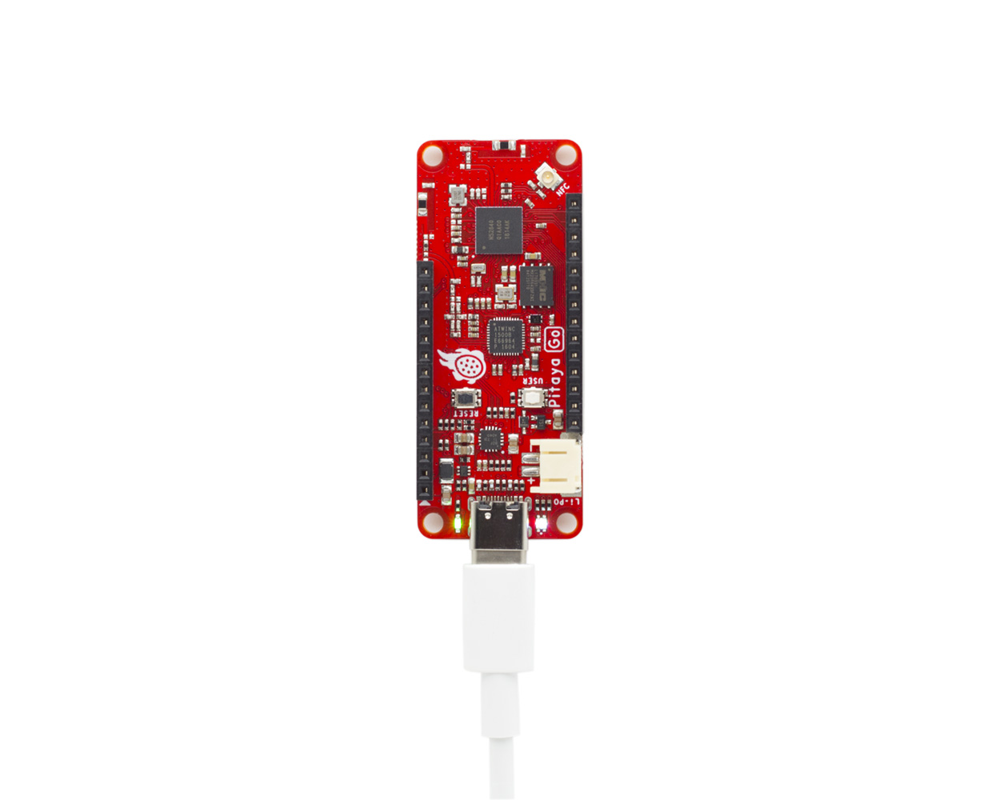

# Blinky Example

## Description

The Blinky Example shows how to configure the GPIO pins as outputs using the BSP module. These outputs can then be used to drive LEDs, as in this example.

!!! Tip
	Before you start building, remember to set up the nRF5 SDK development environment first. See [Setup the nRF5 SDK](../setup-the-nrf5-sdk.md) for details.

## Building the example

You can find the source code and the project file of the example in the following folder: [pitaya-go/examples/peripheral/blinky](https://github.com/makerdiary/pitaya-go/tree/master/examples/peripheral/blinky).

Open terminal and navigate to the directory with the example Makefile:

``` sh
cd ./pitaya-go/examples/peripheral/blinky/armgcc
```

Run `make` to build the example:

``` sh
make
```

## Programming the firmware

After compiled, the firmware is located in `blinky/armgcc/_build` with the name `nrf52840_xxaa.hex`.

While pushing the **USER** button, press the **RESET** button to enter the DFU (Device Firmware Update) mode. Then program the firmware using the [nRF Connect for Desktop](https://www.nordicsemi.com/Software-and-Tools/Development-Tools/nRF-Connect-for-desktop) tool.

!!! Tip
	See **[Programming](../../programming.md)** section for details about how to program your Pitaya Go.

## Testing

Once the firmware is programmed successfully, observe that the LEDs are blinking:



## Create an Issue

Interested in contributing to this project? Want to report a bug? Feel free to click here:

<a href="https://github.com/makerdiary/pitaya-go/issues/new"><button data-md-color-primary="marsala"><i class="fa fa-github"></i> Create an Issue</button></a>
