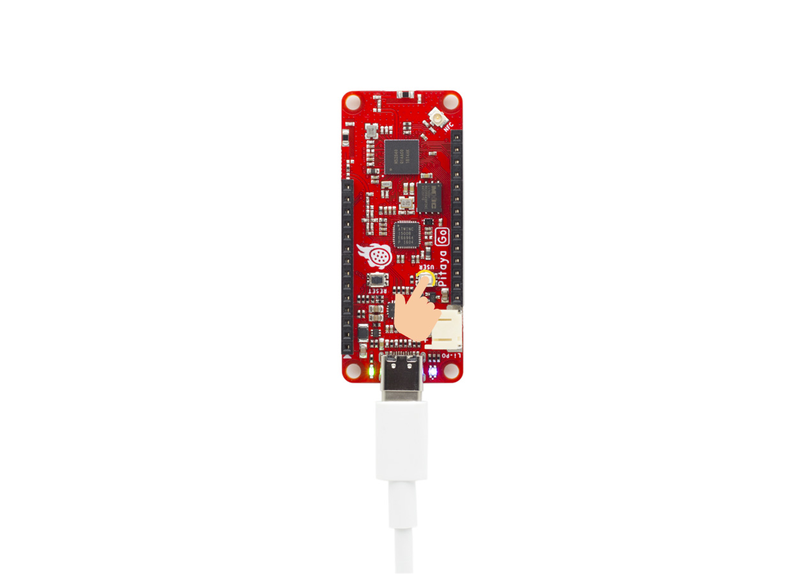
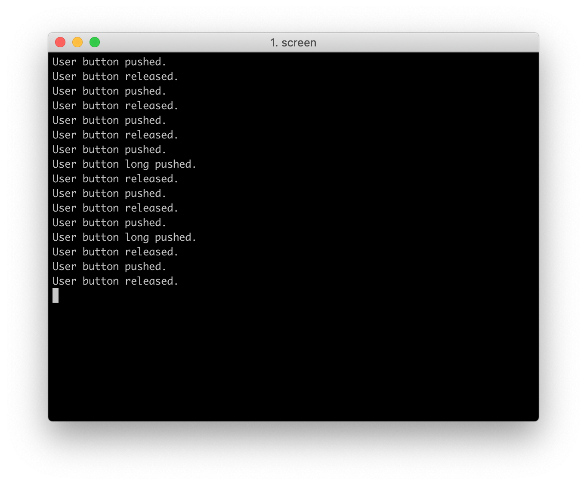

# Button Example

## Description

The Button Example demonstrates how to get the USER button state with the BSP module. 

In this example, there are three actions that can be performed on the USER button: 

* BSP_BUTTON_ACTION_PUSH
* BSP_BUTTON_ACTION_RELEASE
* BSP_BUTTON_ACTION_LONG_PUSH.

When the button action is detected, this callback function will be called to notify the button state.

!!! Tip
	Before you start building, remember to set up the nRF5 SDK development environment first. See [Setup the nRF5 SDK](../setup-the-nrf5-sdk.md) for details.

## Building the example

The source code and the project file of the example are located in the following folder: [pitaya-go/examples/peripheral/button](https://github.com/makerdiary/pitaya-go/tree/master/examples/peripheral/button).

Open terminal and navigate to the directory with the example Makefile:

``` sh
cd ./pitaya-go/examples/peripheral/button/armgcc
```

Run `make` to build the example:

``` sh
make
```

## Programming the firmware

After compiled, the firmware is located in `blinky/armgcc/_build` with the name `nrf52840_xxaa.hex`.

While pushing the **USER** button, press the **RESET** button to enter the DFU mode. Then program the firmware using the [nRF Connect for Desktop](https://www.nordicsemi.com/Software-and-Tools/Development-Tools/nRF-Connect-for-desktop) tool.

!!! Tip
	See **[Programming](../../programming.md)** section for details about how to program your Pitaya Go.

## Testing

Test the example by performing the following steps:

Run a terminal application like [PuTTY](https://www.chiark.greenend.org.uk/~sgtatham/putty/) or [screen](https://www.gnu.org/software/screen/manual/screen.html):

``` sh
screen /dev/cu.usbmodemD2E39D222D781 115200
```

Press the USER button and observe the LEDs and output of the terminal.






## Create an Issue

Interested in contributing to this project? Want to report a bug? Feel free to click here:

<a href="https://github.com/makerdiary/pitaya-go/issues/new"><button data-md-color-primary="marsala"><i class="fa fa-github"></i> Create an Issue</button></a>
