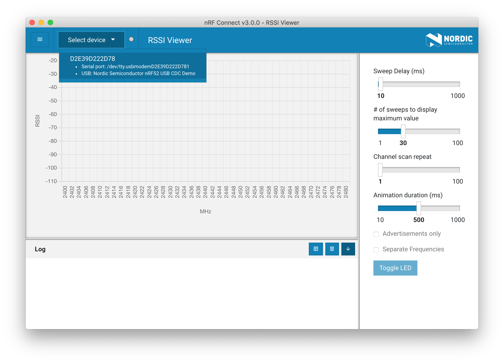

# RSSI Viewer Example

## Description

The RSSI Viewer Example shows how to behave a RSSI Viewer and send RSSI data over serial port.

The [nRF Connect RSSI Viewer](https://github.com/NordicSemiconductor/pc-nrfconnect-rssi) app shows dBm per frequency in the 2400-2480 MHz range, and allows the user to tweak settings like sweep delay and animation duration.


!!! Tip
	Before you start building, remember to set up the nRF5 SDK development environment first. See [Setup the nRF5 SDK](../setup-the-nrf5-sdk.md) for details.

## Building the example

You can find the source code and the project file of the example in the following folder: [pitaya-go/examples/peripheral/rssi_viewer](https://github.com/makerdiary/pitaya-go/tree/master/examples/peripheral/rssi_viewer).

Open terminal and navigate to the directory with the example Makefile:

``` sh
cd ./pitaya-go/examples/peripheral/rssi_viewer
```

Run `make` to build the example:

``` sh
make
```

## Programming the firmware

If compiled successfully, the firmware is located in `rssi_viewer/armgcc/_build` with the name `nrf52840_xxaa.hex`.

While pushing the **USER** button, press the **RESET** button to enter the DFU mode. Then program the firmware using the [nRF Connect for Desktop](https://www.nordicsemi.com/Software-and-Tools/Development-Tools/nRF-Connect-for-desktop) tool.

!!! Tip
	See **[Programming](../../programming.md)** section for details about how to program your Pitaya Go.


## Testing

Test the RSSI Viewer Example application by performing the following steps:

1. Install the **RSSI Viewer** app in [nRF Connect](https://www.nordicsemi.com/Software-and-Tools/Development-Tools/nRF-Connect-for-desktop) by clicking <kbd>Add/remove apps</kbd>.

	

2. Launch RSSI Viewer app and connect to Pitaya Go by selecting its serial port.

	

3. Observe the RSSI data chart and try to tweak settings like sweep delay and animation duration.

	

## Create an Issue

Interested in contributing to this project? Want to report a bug? Feel free to click here:

<a href="https://github.com/makerdiary/pitaya-go/issues/new"><button data-md-color-primary="marsala"><i class="fa fa-github"></i> Create an Issue</button></a>
