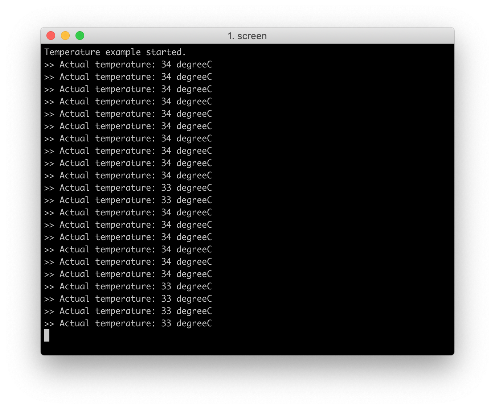

# Temperature Example

The Temperature Example shows how to use the temperature sensor inside nRF52840 chip and print the measurement.

The application starts with configuring the temperature module and the console over USB CDC ACM. The main loop reads the temperature sensor and prints measurement every 500 milliseconds.

!!! Tip
	Before you start building, remember to set up the nRF5 SDK development environment first. See [Setup the nRF5 SDK](../setup-the-nrf5-sdk.md) for details.

## Building the example

You can find the source code and the project file of the example in the following folder: [pitaya-go/examples/peripheral/temperature](https://github.com/makerdiary/pitaya-go/tree/master/examples/peripheral/temperature).

Open terminal and navigate to the directory with the example Makefile:

``` sh
cd ./pitaya-go/examples/peripheral/temperature/armgcc
```

Run `make` to build the example:

``` sh
make
```

## Programming the firmware

If compiled successfully, the firmware is located in `temperature/armgcc/_build` with the name `nrf52840_xxaa.hex`.

While pushing the **USER** button, press the **RESET** button to enter the DFU mode. Then program the firmware using the [nRF Connect for Desktop](https://www.nordicsemi.com/Software-and-Tools/Development-Tools/nRF-Connect-for-desktop) tool.

!!! Tip
	See **[Programming](../../programming.md)** section for details about how to program your Pitaya Go.


## Testing

Test the example by performing the following steps:

Run a terminal application like [PuTTY](https://www.chiark.greenend.org.uk/~sgtatham/putty/) or [screen](https://www.gnu.org/software/screen/manual/screen.html):

``` sh
screen /dev/cu.usbmodemD2E39D222D781 115200
```

In the terminal, press any key to start the example. Observe that a temperature value is printed every 500 milliseconds.



## Create an Issue

Interested in contributing to this project? Want to report a bug? Feel free to click here:

<a href="https://github.com/makerdiary/pitaya-go/issues/new"><button data-md-color-primary="marsala"><i class="fa fa-github"></i> Create an Issue</button></a>

