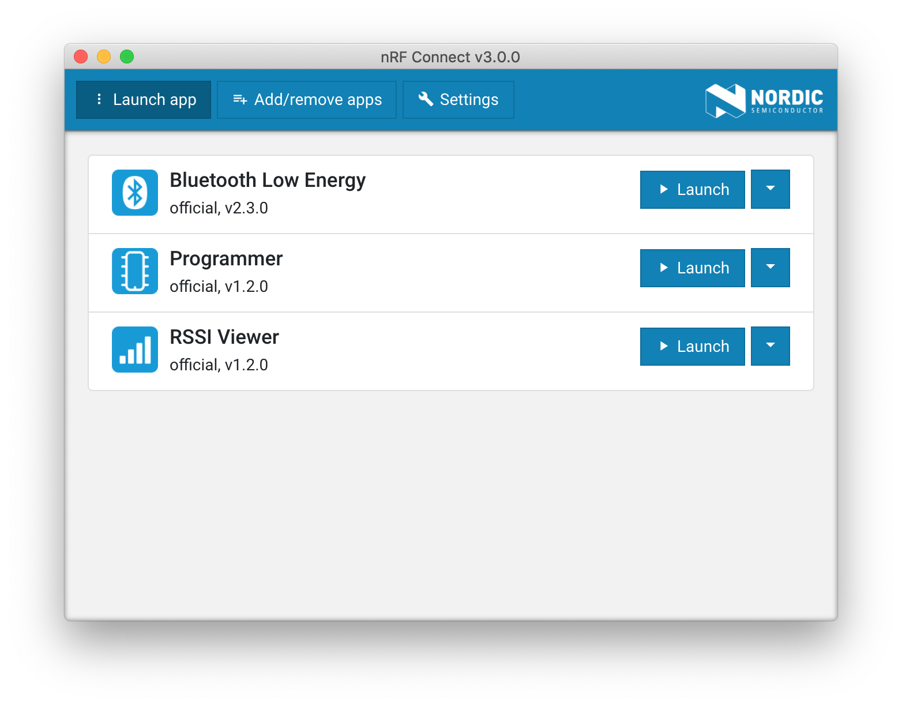
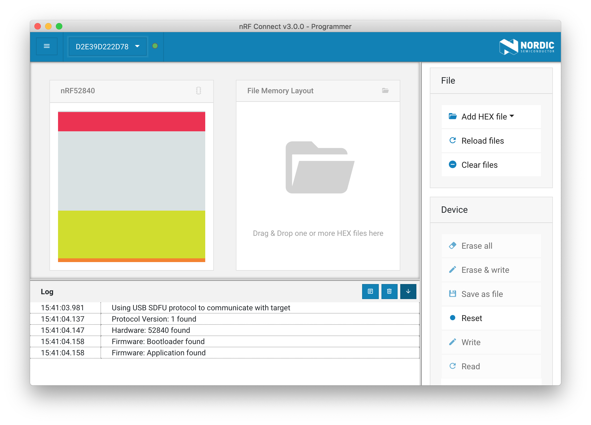
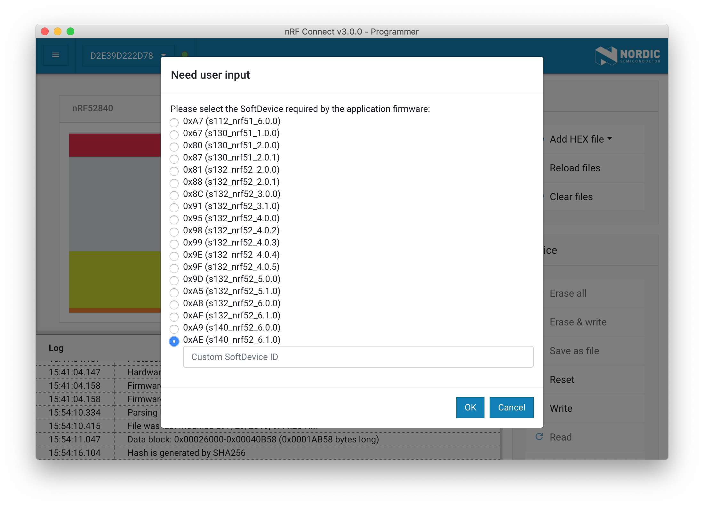

# How to Program Pitaya Go

## Introduction

This section describes how to program your Pitaya Go board on your system.

The Pitaya Go board is pre-programmed with an Open Bootloader for Device Firmware Update (DFU) functionality and also features an SWD interface via Socket Header. So, You can easily program the board using the following tools:

* [nRF Connect for Desktop](https://www.nordicsemi.com/Software-and-Tools/Development-Tools/nRF-Connect-for-desktop).
* [nRF Util](https://github.com/NordicSemiconductor/pc-nrfutil/) from the command line.
* A CMSIS-DAP Debug Probe

## Using nRF Connect for Desktop

[nRF Connect for Desktop](https://www.nordicsemi.com/Software-and-Tools/Development-Tools/nRF-Connect-for-desktop) is a cross-platform tool that enables testing and development with Nordic’s products for Bluetooth® Low energy.

nRF Connect contains a programmer app called [nRF Connect Programmer](https://github.com/NordicSemiconductor/pc-nrfconnect-programmer). It is a cross-platform tool that enables programming firmwares to device. Memory layout for Nordic USB devices can be displayed. Content for the HEX files can be displayed, too. Moreover, content of HEX files can be written to the devices.

### Install

To install Programmer you can download binaries from the [nRF Connect product page](https://www.nordicsemi.com/Software-and-Tools/Development-Tools/nRF-Connect-for-desktop) on Nordic Semiconductor web pages.

nRF Connect currently supports the following operating systems:

* Windows
* Ubuntu Linux 64-bit
* macOS

After nRF Connect is installed, you can find Programmer in the app list by clicking <kbd>**Add/remove apps**</kbd>.



### Enter DFU mode

To program firmwares to Pitaya Go, the board MUST be in DFU (Device Firmware Update) mode. Perform the following steps to enter DFU mode:

1. Connect Pitaya Go to your computer.

2. While holding the <kbd>**USER**</kbd> button, press the <kbd>**RESET**</kbd> button. Observe that the RGB LED pulses RED, that is, the device is in DFU mode.

3. Start **nRF Connect for Desktop** and launch **Programmer** app.

4. Select the device in the dropdown in the upper left corner if it is shown. Observe that the memory layout of the device will be displayed.

	[](assets/images/select-softdevice-id.png)


### Program firmwares

Perform the following steps to program firmwares:

1. Click <kbd>**Add HEX file**</kbd> to select the application hex file to program onto the board.

2. Click <kbd>**Write**</kbd> to begin writing the firmware.

3. If the application requires a Softdevice, select the correct Softdevice ID.

	[](assets/images/select-softdevice-id.png)

4. The DFU procedure starts. This may take a few seconds.

	[](assets/images/select-softdevice-id.png)

!!! Note
	The device will reset when the upgrade completes and Pitaya Go will no longer show up in nRF Connect unless the application used DFU Trigger Library, as it is no longer in DFU mode. You will get an warning stating "Reopen device failed" in this case. You can just ignore this warning.

## Using nRF Util

[nRF Util](https://github.com/NordicSemiconductor/pc-nrfutil) is a Python package and command-line utility that supports Device Firmware Updates (DFU) and cryptographic functionality.

The nRF Util application and its library offer the following features:

* Device firmware update (DFU) package generation
* Cryptographic key generation, management, and storage
* Bootloader settings generation
* DFU procedure over any of the following transports:

	- Bluetooth Low Energy
	- Serial over UART
	- Serial over USB
	- Thread unicast
	- Thread multicast
	- Zigbee
	- ANT

Check out the [nRF Util GitHub Repository](https://github.com/NordicSemiconductor/pc-nrfutil) for more details.

### Install from PyPI

To install the latest published version from the Python Package Index simply type:

``` sh
pip install nrfutil
```

!!! Note
	When installing on macOS, you may need to add `--ignore-installed six` when running pip.


### Generate DFU package

Generate a package (`.zip` file) that you can later use to update. This command takes several options that you can list using:

``` sh
nrfutil pkg generate --help
```

Below is an example of the generation of a package from an application's `nrf52840_xxaa.hex` file:

``` sh
nrfutil pkg generate --hw-version 52 --sd-req 0xAE --application-version 1 --application nrf52840_xxaa.hex nrf52840_xxaa_dfu_pkg.zip
```

The parameters stand for the following:

* `--sd-req`: The SoftDevice firmware ID which is present on the target device. If no Softdevice present, set to `0x00`.
* `--application-version`: The application version.
* `--application`: The application firmware file.


### Update the package

To update the package to Pitaya Go, the board MUST be in DFU mode. Perform the following steps to update the package generated above:

1. Connect Pitaya Go to your computer.

2. While holding the <kbd>**USER**</kbd> button, press the <kbd>**RESET**</kbd> button. Observe that the RGB LED pulses RED, that is, the device is in DFU mode.

3. This command takes several options that you can list using:

	``` sh
	nrfutil dfu usb-serial --help
	```

4. Use the following command to start the DFU procedure:

	``` sh
	nrfutil dfu usb-serial -pkg nrf52840_xxaa_dfu_pkg.zip -p /dev/cu.usbmodemD2E39D222D781
	```
	The parameters stand for the following:

	* `-pkg`: Filename of the DFU package.
	* `-p`: Serial port address to which the device is connected.

	

## Using a CMSIS-DAP Debug Probe

Pitaya Go features an SWD interface via Socket Header, which is designed for an external debug probe to debug and download code.

The CMSIS-DAP (also known as [DAPLink](https://armmbed.github.io/DAPLink/)) standard is supported by many of the most known development and debugging tools, including KEIL uVision, IAR Embedded Workbench and OpenOCD.

If you have a DAPLink debug probe in your hand, you can use [pyOCD](https://github.com/mbedmicro/pyOCD) to flash/erase the chip memory.

pyOCD is an Open Source python 2.7 based library for programming and debugging ARM Cortex-M microcontrollers using CMSIS-DAP. Linux, OSX and Windows are supported.

The latest stable version of pyOCD may be installed via [pip](https://pip.pypa.io/en/stable/index.html) as follows:

``` sh
pip install -U pyocd
```

Alternatively, to install the latest prerelease version from the HEAD of the master branch, you can do the following:

``` sh
pip install --pre -U https://github.com/mbedmicro/pyOCD/archive/master.zip
```

Perform the following steps to flash/erase the memory:

1. Connect DAPLink to Pitaya Go.

2. Use the following command to flash the board:

	``` sh
	pyocd flash -t nrf52840 nrf52840_xxaa.hex
	```

3. Use the following command to perform a chip erase:

	``` sh
	pyocd erase -t nrf52840 --chip
	```

## Create an Issue

Interested in contributing to this project? Want to report a bug? Feel free to click here:

<a href="https://github.com/makerdiary/pitaya-go/issues/new"><button data-md-color-primary="marsala"><i class="fa fa-github"></i> Create an Issue</button></a>
