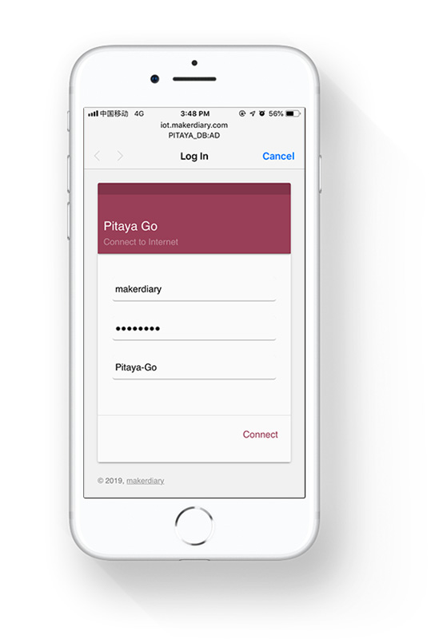
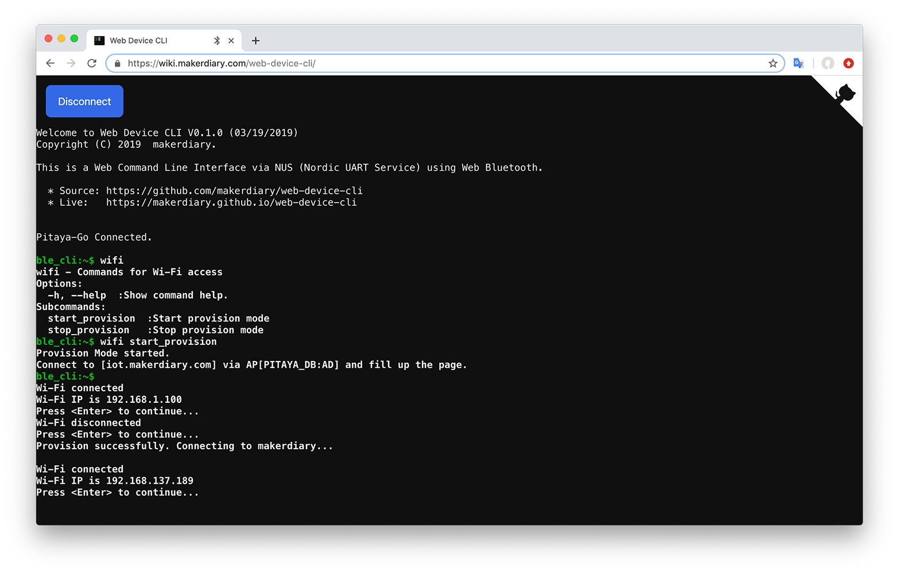

# How to Run HTTP Provision Mode 

## Description

This example demonstrates the use of the Wi-Fi module with the Pitaya Go board to start the HTTP Provision Mode.

This example also implements the Command Line Interface over BLE NUS and USB CDC ACM. Both consoles can be opened and used independently.

!!! Tip
	Before you start building, remember to set up the nRF5 SDK development environment first. See [Setup the nRF5 SDK](../../nrf5-sdk/setup-the-nrf5-sdk.md) for details.

## Building the example

You can find the source code and the project file of the example in the following folder: [pitaya-go/examples/wifi/provision_http_example](https://github.com/makerdiary/pitaya-go/tree/master/examples/wifi/provision_http_example).

Open terminal and navigate to the directory with the example Makefile:

``` sh
cd ./pitaya-go/examples/wifi/provision_http_example/armgcc
```

Run `make` to build the example:

``` sh
make
```

## Programming the firmware

If compiled successfully, the firmware is located in `provision_http_example/armgcc/_build` with the name `nrf52840_xxaa.hex`.

While pushing the **USER** button, press the **RESET** button to enter the DFU mode. Then program the firmware using the [nRF Connect for Desktop](https://www.nordicsemi.com/Software-and-Tools/Development-Tools/nRF-Connect-for-desktop) tool.

If the SoftDevice is not programmed before, remember to add the SoftDevice. The SoftDevice is located in `<nRF5 SDK>/components/softdevice/s140/hex/s140_nrf52_6.1.0_softdevice.hex`.

!!! Tip
	See **[Programming](../../programming.md)** section for details about how to program your Pitaya Go.

## Testing

The application is now programmed and running. Perform the following steps to start the HTTP Provision Mode:

1. Run a terminal application like [PuTTY](https://www.chiark.greenend.org.uk/~sgtatham/putty/) or [screen](https://www.gnu.org/software/screen/manual/screen.html):

	``` sh
	screen /dev/cu.usbmodemD2E39D222D781 115200
	```

2. Press <kbd>Enter</kbd> in the terminal. A console prompt is displayed.

3. Use command `wifi` to print the command help information.

4. Use command `wifi start_provision` to start the HTTP Provision Mode. Observe that the following information will display on the terminal window.

	``` sh
	Provision Mode started.
	Connect to [iot.makerdiary.com] via AP[PITAYA_XX:XX] and fill up the page.
	```

5. Use a mobile device to scan the network and join `PITAYA_XX:XX`. 

6. Observe that BLUE LED is lit and the Wi-Fi IP will display, that is, the device is connected.

7. Populate the setup page, and then press Connect.

	

8. Pitaya Go will be connected to the AP that you configured.

	

9. You can also use the [Web Device CLI](https://wiki.makerdiary.com/web-device-cli/) application to test this example.

	<a href="https://wiki.makerdiary.com/web-device-cli/" target="_blank"><button data-md-color-primary="marsala">Web Device CLI</button></a>

[](assets/images/provision-http-example-web.png)

## Create an Issue

Interested in contributing to this project? Want to report a bug? Feel free to click here:

<a href="https://github.com/makerdiary/pitaya-go/issues/new"><button data-md-color-primary="marsala"><i class="fa fa-github"></i> Create an Issue</button></a>
