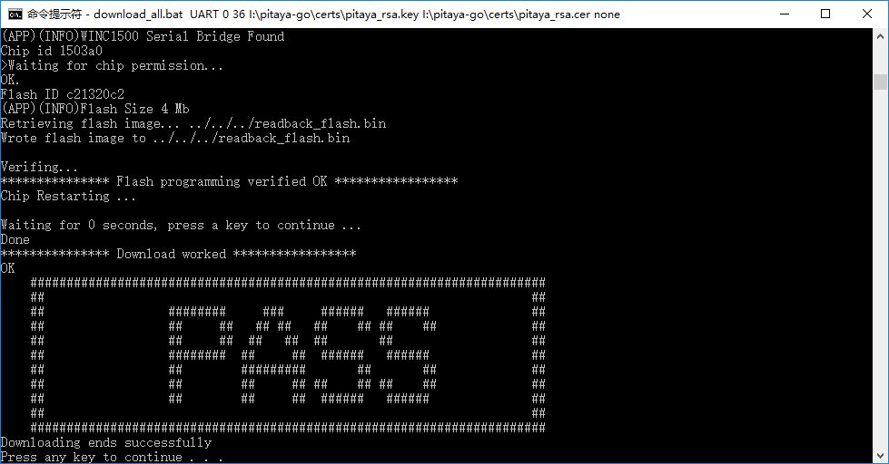

# How to Download Wi-Fi Firmware

## Description

As the WINC device is connected to host MCU through SPI interface, upgrading the WINC serial Flash via the host MCU is an easier solution. 

Since the WINC provides transparent access to host MCU, the WINC serial Flash can be read/written from host MCU. The host MCU can program the serial (SPI) Flash without the need for operational firmware in the WINC. 

The host MCU running the serial bridge firmware is connected between a Windows computer and a WINC SPI to download the firmware to a WINC serial Flash.

This section details how to download new Wi-Fi firmware into the WINC serial Flash.

!!! Tip
	Before you start download, see [Prepare for Setup](index.md) for prerequisites.

## Steps

Perform the following steps to download the firmware:

1. Program Pitaya Go with the serial bridge firmware: **[serial_bridge_usb_pitaya_go_vx.x.x.hex](https://github.com/makerdiary/pitaya-go/tree/master/firmware/wifi/)**.

2. Connect Pitaya Go to a Windows computer. Check the comport number of the device detected.

3. Open CMD and navigate to the directory with the Wi-Fi utils:

	``` sh
	cd .\pitaya-go\utils\wifi
	```

4. Run `download_all.bat` script to download the Wi-Fi firmware, TLS/SSL root certificate, and TX power gain values:

	``` sh
	download_all.bat UART 0 {comport} {private_key_path} {rsa_cert_path} {ecdsa_cert_path}
	```
	The parameters stand for the following:

	* `{comport}`: Number of the serialport (e.g. `36` represents `COM36`).
	* `{private_key_path}`: Path of the TLS Private Key. Can be `none` if no key present.
	* `{rsa_cert_path}`: Path of RSA based Certificate. Can be `none` if no certificate present.
	* `{ecdsa_cert_path}`: Path of ECC based Certificate. Can be `none` if no certificate present.

5. After several seconds, the following message appears in order to indicate that the download procedure is successfully completed.

	

## Create an Issue

Interested in contributing to this project? Want to report a bug? Feel free to click here:

<a href="https://github.com/makerdiary/pitaya-go/issues/new"><button data-md-color-primary="marsala"><i class="fa fa-github"></i> Create an Issue</button></a>

