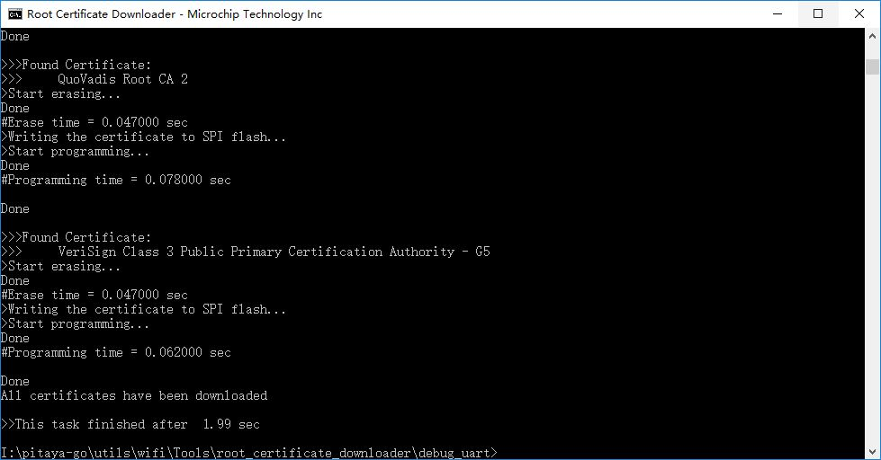

# How to Download Root Certificates

## Description

The WINC saves the Root certificates inside the serial Flash in 4K sector (the maximum size of all certificates in Flash must be less than 4K). The following procedure explains how to download the Root certificates.

!!! Tip
	Before you start download, see [Prepare for Setup](index.md) for prerequisites.

## Steps

Perform the following steps to download Root certificates:

1. Program Pitaya Go with the serial bridge firmware: **[serial_bridge_usb_pitaya_go_vx.x.x.hex](https://github.com/makerdiary/pitaya-go/tree/master/firmware/wifi/)**.

2. Connect Pitaya Go to a Windows computer. Check the comport number of the device detected.

3. Paste new Root certificates in the `utils\wifi\Tools\root_certificate_downloader\binary` folder.

4. Open CMD and navigate to the directory with *root_certificate_downloader.exe*:

	``` sh
	cd .\pitaya-go\utils\wifi\Tools\root_certificate_downloader\debug_uart\
	```

5. Run `RootCertDownload.bat` script to download all Root certificates.

	``` sh
	RootCertDownload.bat {comport}
	```
	where `{comport}` is the number of the serialport (e.g. `36` represents `COM36`).

6. After a few seconds, the following message appears to indicate that the root certificates are successfully downloaded.

	

!!! Note 
	If certificate upload fails with **(ERROR) Root Certificate Flash is Full**, that is, the allocated memory in SPI flash on ATWINC1500B for certificates is full. Try after removing one or more certificates from `utils\wifi\Tools\root_certificate_downloader\binary`.

## Create an Issue

Interested in contributing to this project? Want to report a bug? Feel free to click here:

<a href="https://github.com/makerdiary/pitaya-go/issues/new"><button data-md-color-primary="marsala"><i class="fa fa-github"></i> Create an Issue</button></a>

